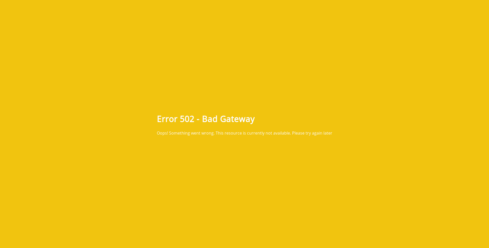
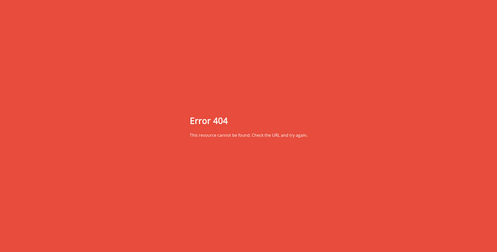
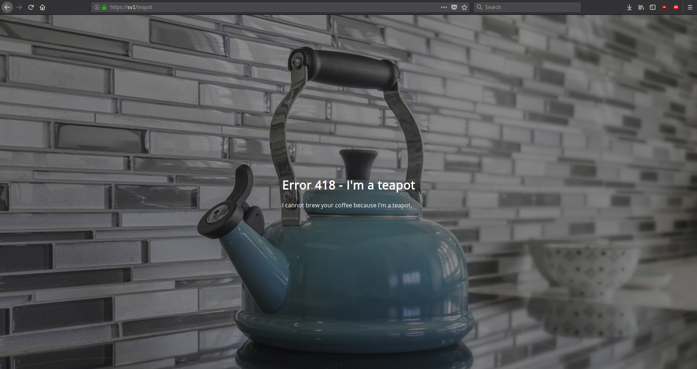

# nginx-error-pages
Make your nginx error pages look great

## Installation
```bash
mkdir -p /srv/http/default
git clone https://github.com/denysvitali/nginx-error-pages /srv/http/default
mkdir /etc/nginx/snippets/
ln -s /srv/http/default/snippets/error_pages.conf /etc/nginx/snippets/error_pages.conf
ln -s /srv/http/default/snippets/error_pages_content.conf /etc/nginx/snippets/error_pages_content.conf
```
Then add to each of your vhosts the following:
```
include snippets/error_pages.conf;
```

Example:
```nginx
$ cat /etc/nginx/conf.d/plex.conf 

server {
        listen       80;
        listen       [::]:80;
        listen       443 ssl http2;
        listen       [::]:443 ssl http2;
        server_name  plex.sv1 plex.sv1.lnet;
        include snippets/ssl.conf;
        include snippets/error_pages.conf; # <== This
        root         /usr/share/nginx/html;

        location / {
                include snippets/reverse-proxy.conf;
                proxy_pass https://127.0.0.1:32400;
        }
}
```


## Screenshots
### 502 Error Page


### 404 Error Page


### 418 - I'm a Teapot

